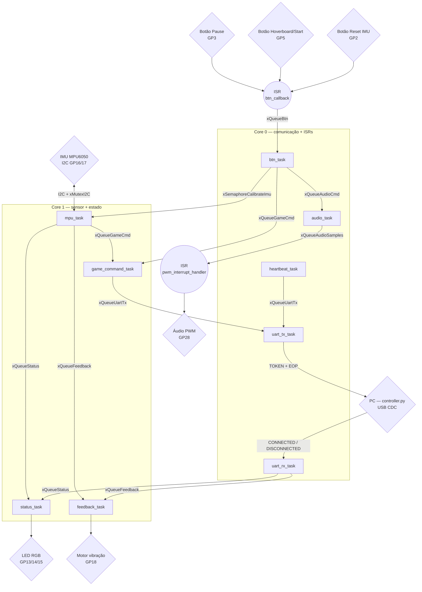

# APS 2 - Controle Embarcado

Controle físico, em formato de **hoverboard**, para jogar **Subway Surfers** no
computador. O controle é uma **Raspberry Pi Pico 2 (RP2350)** rodando **FreeRTOS
em modo SMP (2 cores)**, que lê a inclinação por uma IMU e os botões por
interrupção, e envia comandos ao PC por **USB CDC**. Um script Python no PC
traduz cada comando em uma tecla do jogo.

---

## 1. Jogo

O projeto foi desenvolvido para o jogo **Subway Surfers**.

No jogo, o personagem corre automaticamente para frente e o jogador precisa
desviar de obstáculos, coletar itens e sobreviver pelo maior tempo possível.

Ações principais:

- Mudar para a faixa da direita
- Mudar para a faixa da esquerda
- Pular obstáculos
- Rolar/deslizar por baixo de obstáculos
- Ativar o hoverboard (habilidade especial)

---

## 2. Ideia do controle

O controle é um **controle físico em formato de hoverboard**, segurado com as
duas mãos. O jogador controla o personagem principalmente por **inclinações**
detectadas por uma IMU, e usa botões para as ações de menu e habilidades.

A estrutura mecânica prevista:

- Corpo principal alongado em formato de hoverboard
- Parte superior plana para fixação dos botões
- Espaço interno para a Pico, IMU, fios e bateria
- Aberturas para o cabo USB e para o LED de status

### Comandos por inclinação (IMU)

| Movimento físico do controle | Ação no jogo | Comando enviado |
|---|---|---|
| Inclinar para a direita | Muda para a faixa da direita | `MOVE_RIGHT` |
| Inclinar para a esquerda | Muda para a faixa da esquerda | `MOVE_LEFT` |
| Inclinar para cima | Pula | `JUMP` |
| Inclinar para baixo | Rola/desliza | `ROLL` |

A detecção usa **histerese** (dispara um comando ao passar de 20°, só rearma ao
voltar para dentro de 10°), evitando comandos repetidos enquanto o jogador
segura a inclinação. O centro/neutro é **calibrado** no boot e pelo botão de
reset da IMU.

---

## 3. Inputs e Outputs

### 3.1 Inputs

#### IMU (MPU6050)

Sensor principal do controle, lido por **I2C** a 100 Hz. A fusão de
acelerômetro + giroscópio é feita pelo **Fusion AHRS**, de onde saem os ângulos
de *roll* (esquerda/direita) e *pitch* (cima/baixo).

| Item | Valor |
|---|---|
| Barramento | I2C0 — SDA `GP16`, SCL `GP17` |
| Endereço | `0x68` |
| Frequência I2C | 400 kHz |
| Taxa de amostragem | 100 Hz |

#### Botões digitais (3 botões, todos por interrupção/callback)

Os botões são GPIO de entrada com **pull-up** e tratados por **interrupção**
(`gpio_set_irq_enabled` na borda de descida). A ISR só publica o pino acionado
numa fila; o **debounce** (200 ms) é feito no `btn_task`.

| Botão | GPIO | Função |
|---|---|---|
| Pause | `GP3` | Pausa/retoma o jogo (`PAUSE`) |
| Hoverboard / Start | `GP5` | Ativa a habilidade especial **e inicia a partida** — no Subway Surfers a tecla Espaço faz as duas coisas (`HOVERBOARD`) |
| Reset IMU | `GP2` | Recalibra o centro/neutro da IMU (tratado localmente) |

> O mesmo botão de Hoverboard (`GP5`) é usado para iniciar a partida no menu e
> ativar o hoverboard na corrida, conforme o momento do jogo.

### 3.2 Outputs

#### LED de status (RGB, GP13/14/15)

LED RGB de cátodo comum, dono exclusivo da `status_task`. Renderização por
prioridade:

| Estado | Indicação |
|---|---|
| Calibrando a IMU | Branco piscando |
| Morte do jogador (evento do PC) | Vermelho (por ~1,5 s) |
| Conectado ao PC | Verde |
| Desconectado | Amarelo |

#### Motor de vibração (GP18)

Feedback háptico, dono exclusivo da `feedback_task`:

- Pulso **curto** (80 ms): eventos locais (hoverboard, calibração concluída, conexão).


#### Áudio (PWM em GP28)

Efeitos sonoros via PWM (DAC de 1 bit + filtro RC), dono da `audio_task`
alimentando uma ISR de PWM:

- Som ao **pausar**.
- Som de **power-up** ao ativar o hoverboard.

---

## 4. Protocolo de comunicação

A comunicação Controle ↔ PC é feita por **USB CDC** (porta serial virtual da
própria Pico — não é necessário debug probe nem adaptador UART). Cada mensagem
é um **token de texto** terminado por um byte de **EOP**.

- **EOP:** `'\n'` (`0x0A`), definido em `main.c` e em `pc/controller.py`.

### Controle → PC
`MOVE_LEFT` · `MOVE_RIGHT` · `JUMP` · `ROLL` · `START` · `PAUSE` ·
`HOVERBOARD` · `RESET_IMU` · `HEARTBEAT`

> `HEARTBEAT` é enviado a cada 1 s. Se o PC não responder `CONNECTED` dentro de
> 2,5 s, o controle se considera desconectado (LED amarelo). `RESET_IMU` é
> tratado localmente no controle, então o PC o ignora.

### PC → Controle
`CONNECTED` · `DISCONNECTED` · 

---

## 5. Arquitetura de firmware (FreeRTOS)

O firmware é totalmente orientado a **RTOS**: nenhuma variável global é usada
para troca de estado entre tasks — a comunicação é por **filas, semáforos e
mutex**. As ISRs são curtas e apenas sinalizam tasks.

### 5.1 Tasks

| Task | Prioridade | Core | Responsabilidade |
|---|---|---|---|
| `mpu_task` | 2 | 1 | Lê a IMU a 100 Hz, roda o Fusion AHRS, calibra e converte inclinação em comandos |
| `game_command_task` | 2 | 1 | Traduz comando de jogo → token do protocolo |
| `status_task` | 2 | 1 | Dono único do LED RGB de status |
| `feedback_task` | 2 | 1 | Dono único do motor de vibração |
| `btn_task` | 2 | 0 | Recebe eventos dos botões (via ISR), faz debounce e gera comandos |
| `uart_tx_task` | 2 | 0 | Único escritor da USB: envia `TOKEN + EOP` |
| `uart_rx_task` | 2 | 0 | Lê a USB e interpreta as mensagens do PC |
| `heartbeat_task` | 1 | 0 | Envia `HEARTBEAT` periódico |
| `audio_task` | 2 | 0 | Dono único da reprodução de áudio (PWM) |

### 5.2 Filas, semáforos e mutex

| Objeto | Tipo | De → Para |
|---|---|---|
| `xQueueBtn` | Fila | ISR dos botões → `btn_task` |
| `xQueueGameCmd` | Fila | `mpu_task` / `btn_task` → `game_command_task` |
| `xQueueUartTx` | Fila | `game_command_task` / `heartbeat_task` → `uart_tx_task` |
| `xQueueStatus` | Fila | `mpu_task` / `uart_rx_task` → `status_task` |
| `xQueueFeedback` | Fila | várias → `feedback_task` |
| `xQueueAudioCmd` | Fila | `btn_task` → `audio_task` (qual som tocar) |
| `xQueueAudioSamples` | Fila | `audio_task` → PWM ISR (amostras do som) |
| `xSemaphoreCalibrateImu` | Semáforo bin. | `btn_task` → `mpu_task` (pedido de recalibração) |
| `xMutexI2C` | Mutex | Serializa o acesso ao barramento I2C da IMU |

### 5.3 ISRs

| ISR | Disparo | Ação |
|---|---|---|
| `btn_callback` | Borda de descida nos GPIOs dos botões | `xQueueSendFromISR(xQueueBtn)` |
| `pwm_interrupt_handler` | Wrap do PWM de áudio | Puxa a próxima amostra de `xQueueAudioSamples` e aplica ao DAC |

### 5.4 Multicore (SMP)

O FreeRTOS roda nos **2 cores do RP2350** (`configNUMBER_OF_CORES=2`), e cada
task é fixada a um core com `vTaskCoreAffinitySet` (máscara `0x01` = Core 0,
`0x02` = Core 1).

- **Core 0 — comunicação + ISRs:** `uart_tx_task`, `uart_rx_task`,
  `heartbeat_task`, `audio_task`, `btn_task`. A USB CDC e as interrupções de
  PWM (áudio) e GPIO (botões) são habilitadas no Core 0 dentro do `main()`;
  manter as tasks que conversam com essas ISRs no mesmo core evita corrida
  cross-core.
- **Core 1 — sensor + estado:** `mpu_task`, `game_command_task`, `status_task`,
  `feedback_task`. Isola a carga mais pesada — o **Fusion AHRS a 100 Hz** — do
  I/O da USB, para que o processamento do sensor não atrase a comunicação.

> Observação: usar 2 cores **nem sempre** melhora o desempenho. Aqui o objetivo
> é separar o processamento contínuo do AHRS (Core 1) do I/O da USB (Core 0).

### 5.5 Diagrama de blocos do firmware

Notação (padrão da disciplina): **quadrado = task**, **círculo = interrupção
(ISR)**, **losango = periférico de hardware**, **seta = fila/semáforo**. As
tasks estão agrupadas pelo core em que rodam (SMP).



---

## 6. Software no PC (`pc/controller.py`)

Ponte entre o controle e o jogo no navegador:

- Lê os pacotes da serial USB (CDC), separa por EOP e **simula a tecla**
  correspondente na janela em foco (via `pydirectinput`).
- Responde `CONNECTED` a cada `HEARTBEAT` (mantém o LED de status verde).
- Tecla de teste **`m`** envia `PLAYER_DIED` (simula a morte → LED vermelho +
  vibração longa no controle).
- **Detecta a porta automaticamente** pelo VID da Raspberry Pi (`0x2E8A`),
  então não é preciso descobrir o número da COM.

Mapeamento token → tecla:

| Token | Tecla |
|---|---|
| `MOVE_LEFT` / `MOVE_RIGHT` | ← / → |
| `JUMP` / `ROLL` | ↑ / ↓ |
| `HOVERBOARD` | Espaço (inicia a partida no menu e ativa o hoverboard na corrida) |
| `PAUSE` | Esc |

Uso:

```bash
pip install -r pc/requirements.txt
python pc/controller.py               # acha a Pico sozinho
python pc/controller.py --port COM9   # forçar uma porta específica
```

---
## 7. Proposta de controle


---

## 8. Controle REAL + em funcionamento:
https://youtube.com/shorts/jVHelj1vHhE?feature=share 